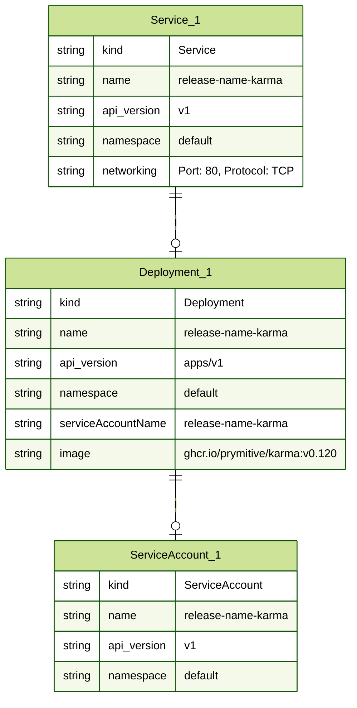

# Kubernetes YAML to Mermaid ER Diagram Script

This script parses Kubernetes YAML files to generate Entity-Relationship (ER) diagrams in Mermaid format. It focuses on visualizing relationships between various Kubernetes resources, such as `Deployments`, `Services`, `ServiceAccounts`, and `ConfigMaps`.

## Features

- **ServiceAccount Links**: Links `Deployments` and `Pods` to their associated `ServiceAccounts`.
- **ConfigMap Links**: Links `Deployments` to `ConfigMaps` if they are referenced in volumes.
- **Service Links**: Links `Services` to `Deployments` based on matching labels in `selector`.

## How It Works

The script reads a YAML file and identifies various Kubernetes resources, creating links between them based on their configurations. The output is a Mermaid ER diagram that visually represents these relationships.

## Usage

1. Place your Kubernetes YAML file in the same directory as the script.
2. Update the `yaml_file` variable in the script with the path to your YAML file.
3. Run the script to generate the Mermaid ER diagram.
4. The diagram will be saved as a `.mmd` file, which you can view using any Mermaid-compatible editor.

## Example

Below is an example of the generated Mermaid diagram:



## Gitlab Call

```bash
curl --request POST --header "PRIVATE-TOKEN: <your_access_token>" \
  --form "file=@output_er.mmd" \
  "https://gitlab.com/api/v4/projects/<your_project_id>/uploads"
```
