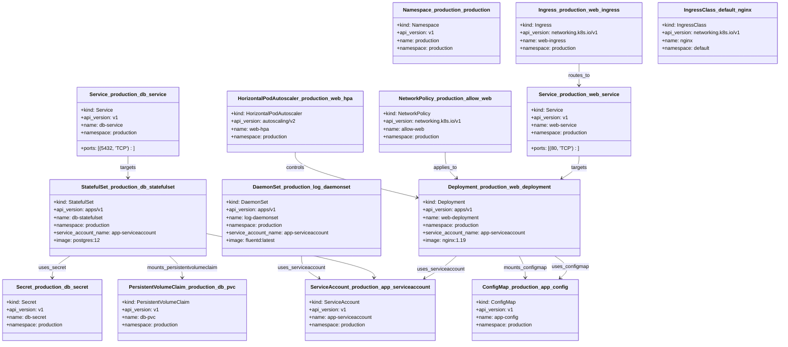

# Kubernetes to Mermaid Diagram Generator

This script parses Kubernetes YAML files and generates a Mermaid class diagram that visualizes the resources and their relationships within a Kubernetes cluster.

## Features

- **Supports multiple resource types**:
  - Processes various Kubernetes resources such as Deployments, StatefulSets, DaemonSets, Services, Ingresses, ConfigMaps, Secrets, PersistentVolumeClaims, NetworkPolicies, and HorizontalPodAutoscalers.

- **Relationship Mapping**:
  - Identifies and represents relationships between resources, including:
    - **Uses**: Indicates when a resource uses another resource (e.g., a Deployment uses a ConfigMap).
    - **Mounts**: Shows when a resource mounts a volume (e.g., a StatefulSet mounts a PersistentVolumeClaim).
    - **Targets**: Represents Services targeting workloads based on selectors.
    - **Controls**: Shows HorizontalPodAutoscalers controlling Deployments or StatefulSets.
    - **Applies To**: Displays NetworkPolicies applied to specific workloads.

- **Optimized and Compact**:
  - The script is optimized to be concise without losing functionality.

- **Customizable Output**:
  - Generates Mermaid class diagrams that can be easily visualized with tools like the [Mermaid Live Editor](https://mermaid.live/).

## Prerequisites

- **Python 3.x**
- **PyYAML Library**

  Install PyYAML using:

  pip install pyyaml




## Gitlab Call

```bash
curl --request POST --header "PRIVATE-TOKEN: <your_access_token>" \
  --form "file=@output_er.mmd" \
  "https://gitlab.com/api/v4/projects/<your_project_id>/uploads"
```
